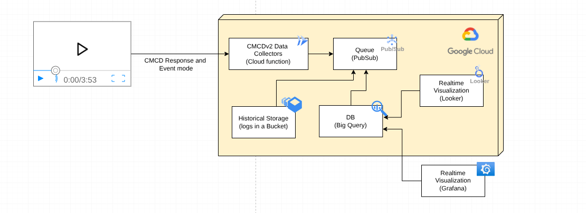

# cmcd-toolkit

cmcd-toolkit is a set of basic tools to collect and analyze data sent by video with [CMCD v2](https://github.com/cta-wave/common-media-client-data) support.

This repository provides tools to collect and analize CMCD v2 locally and in different cloud providers.

## How to deploy in Google Cloud

Deployment in Google Cloud:

Assuming you already have a Google Cloud account, the high-level steps to deploy are:
1. Create a CMCD [BigTable](https://cloud.google.com/bigtable) using schema found in the `gcloud-big-table` folder
2. Create a [Pub/Sub](https://cloud.google.com/pubsub) topic and a suscription to the CMCD BigTable
3. Create a [Cloud Run Function](https://cloud.google.com/functions) with the code found in `index.js` from `collector-gcloud-function`. This will give you a `{public url}` for the collector.
4. Configure in the palyer found in the `palyer` folder the following urls:
    * For response mode: `{public url}/cmcd/response-mode`
    * For event mode: `{public url}/cmcd/event-mode`
5. (Optional) Create a bucket in [Cloud Storage](https://cloud.google.com/storage) with public access and deploy the palyer for testing the system.
6. (Optional) Create a bucket in [Cloud Storage](https://cloud.google.com/storage) and suscribe to the Pub/Sub CMCD topic for long term CMCD storage.
7. (Optinal) Connect a Grafana instance using the BigQuery plugin. Find a Grafana config example in the `grafana` folder.

## How to run localy

*Notice: This is work in progres.*

1. Run `docker compose up`

Player will be available at: [http://localhost:8080](http://localhost:8080)
Colloctor will run at: [http://localhost:3000](http://localhost:3000)

## How to develop

Copy `docker-comose.develop.yml` to `docker-compose.override.yml` and then run `docker compose up`. You will be able to modify the code while running the project

## License

This project is licensed under the Apache 2.0 License. See the `LICENCE` file for more details.
